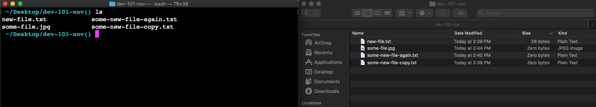

Challenge!
===

Create the following structure inside your `~/alchemy` directory (folder).

## Hint: Have the finder open while you do this!


## Step 0

If you don't have a `~/alchemy` directory, go make one!

```
~
    |
    +- alchemy
```

## Step 1

Make the following directories and subdirectories with `mkdir`, `cd` and `pwd`

```
~
    |
    +- alchemy
        |
        +- dev-101-empty
        |
        +- dev-101-files-to-remove
        |
        +- dev-101
            |
            +-dev-101-sub-directory
```

## Step 2

`cd` into `dev-101-files-to-remove` and create the files listed below with this command: `echo 'words' > name.txt`

```
~
    |
    +- alchemy
        |
        +- dev-101-empty
        |
        +- dev-101-files-to-remove
            |
            +- hello-world.txt  "hello world"
            |
            +- foo-bar.txt  "if foo then bar"
        |
        +- dev-101
            |
            +-dev-101-sub-directory

```

## Step 3

Move files with from `dev-101-files-to-remove` to `dev-101-empty` with `mv`

```
~
    |
    +- alchemy
        |
        +- dev-101-empty
            |
            +- hello-world.txt  "hello world"
            |
            +- foo-bar.txt  "if foo then bar" 
        |
        +- dev-101-files-to-remove
        |
        +- dev-101
            |
            +-dev-101-sub-directory

```


## Step 4

Rename `dev-101-empty` to `dev-101-full` with `mv`.

```
~
    |
    +- alchemy
        |
        +- dev-101-full
            |
            +- hello-world.txt  "hello world"
            |
            +- foo-bar.txt  "if foo then bar"
        |
        +- dev-101-files-to-remove
        |
        +- dev-101
            |
            +-dev-101-sub-directory

```

## Step 5

Remove newly empty `dev-101-files-to-remove` directory with `rmdir`

```
~
    |
    +- alchemy
        |
        +- dev-101-full
            |
            +- hello-world.txt  "hello world"
            |
            +- foo-bar.txt  "if foo then bar" 
        |
        +- dev-101
            |
            +-dev-101-sub-directory
```

## Step 6

Copy `dev-101-full` directory (and name the copy `dev-101-full-copy`) with `cp -r`

```
~
    |
    +- alchemy
        |
        +- dev-101-full
            |
            +- hello-world.txt  "hello world"
            |
            +- foo-bar.txt  "if foo then bar"
        |
        +- dev-101-full-copy
            |
            +- hello-world.txt  "hello world"
            |
            +- foo-bar.txt  "if foo then bar"
        |
        +- dev-101
            |
            +-dev-101-sub-directory
```

## Step 7

Remove the `dev-101-full` directory and its contents with `rm -rf` (keep the copy around).

```
~
    |
    +- alchemy
        |
        +- dev-101-full-copy
            |
            +- hello-world.txt  "hello world"
            |
            +- foo-bar.txt  "if foo then bar"
        |
        +- dev-101
            |
            +-dev-101-sub-directory

```

> Submit a screenshot of your `~/alchemy` directory in the terminal, with the correct directories inside, using `ls -R` to show the contents of all the children in the directory.

## Points Break Down

Looking For | Points (10)
:--|--:
Screenshot in canvas reflects the correct final state of the files in the directory | 10

