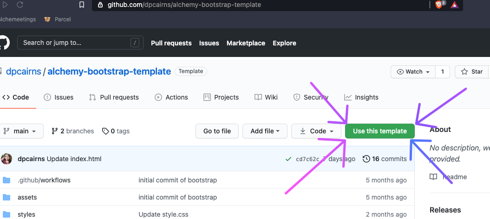
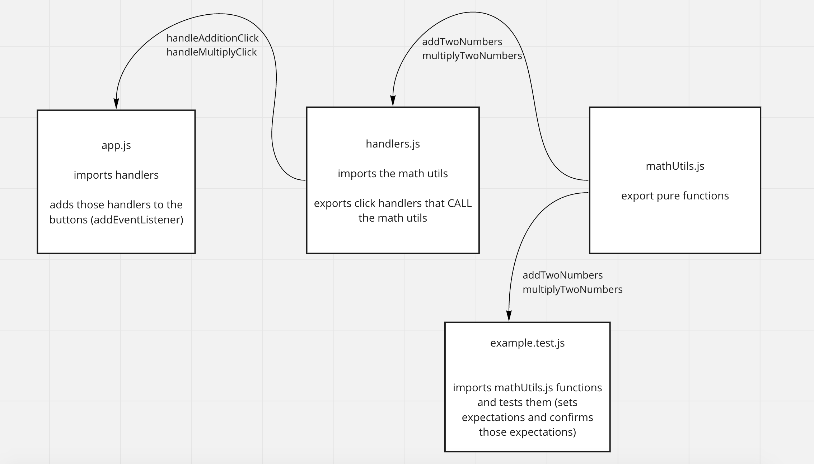
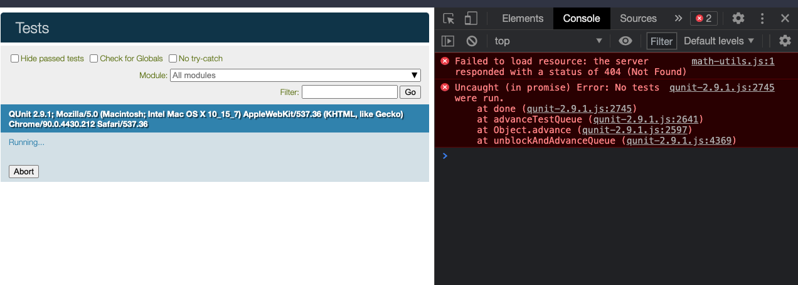
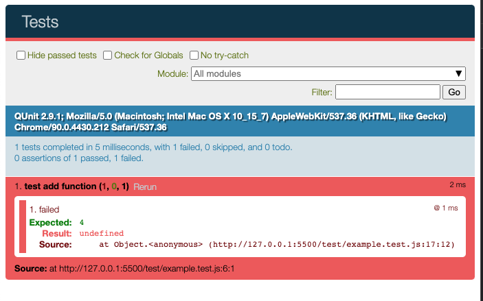

# Lab 03: Let's build a calculator!

## Standard Setup Process

1. Use the [bootstrap template](https://github.com/dpcairns/alchemy-bootstrap-template) to create a new repo called `lab-03-calculator` on Github
 <p align="center">
     
 </p>
1. Copy the URL of the new repo
1. From the command line (terminal) clone your repo:
    1. Check with `pwd` that you are in correct directory for labs
    1. `git clone <url>`
    1. **`cd` into your repo from the command line**
    1. Launch vscode with `code .`

## Goal

There should be two inputs and one button for every operation. When the user enters numbers into the addition inputs, then clicks the add button, the sum should appear in the div.

It might look a little like this:

<p align="center">
    
</p>

## Step by Step Guide to Your First Feature

We should build this vertically, starting with the function to add two numbers, then handling the user interface.
Here's a diagram of what the module architecture should look like:

<p align="center">
    
</p>

Repeat this process for subtraction, multiplication, and division.

1. First setup your basic HTML / CSS which should include two inputs and a button to click

    - Your inputs and buttons will need ids.
    - You will need a span to put the answers into. The span will need an id.

    **_Validation step_**: look at the ids in the Elements tab in the browser

    _Hint: you can spend a little time styling your input but don't get lost in the CSS at this point -- you can always come back and add styles when you have the functionality working_

1. Replace the example test in example.test.js with your addition test

    ```js
    import { add } from '../math-utils.js';

    const test = QUnit.test;

    test('test add function', (expect) => {
        //Arrange
        // Set up your arguments and expectations
        const expected = 4;

        //Act
        // Call the function you're testing and set the result to a const
        const actual = add(2, 2);

        //Expect
        // Make assertions about what is expected versus the actual result
        expect.equal(actual, expected);
    });
    ```

1. Launch your code using LiveServer and navigate to `http://127.0.0.1:5500/test/` -- you should see an error in your console because it cannot find `math-utils.js` -- we'll fix that next!
 <p align="center">
  
  </p>

1. Create the `math-utils.js` file and export an empty `add` function. You should now get a more useful testing error.

    ```js
    export function add(num1, num2) {}
    ```

    <p align="center">
    
    </p>

1. Add at least one more test case to verify that the functions return what you _expect_ them to return

    **_ACP your code with commit message "TDD for add function" and push it to your main branch!_**

1. Add an event listener to your button: - Make sure to add an id to your button - In app.js, create a variable that will hold your button using `document.getElementById`

    **_Validation step_**: log out 'Hello world! I am the add button' to validate that your event handler worked.
    **_ACP your code with commit message "Adding event listener" and push it to your main branch!_**

1. On click, you will need to be able to get the current number the user has typed into the inputs.

    - Get the inputs with `document.getElementById`
    - Get the value by using `.value` on the element and store in a variable
    - Convert the input values to a number using the `Number` function

    **Validation step**: Log out the values of the two inputs inside your event listener

1. On click, you need to add the two values that the user typed in.

    - Import your add function from `math-utils.js` and call it using the number constants created above
    - **Validation step**: log out the correct value

    **_ACP your code with commit message "Getting values and calling add function" and push it to your main branch!_**

1. On click, you'll need to put the correct answer into the using its `textContent` property and the `=` assignment operator.

    **_ACP your code with commit message "Updating HTML with answer" and push it to your main branch!_**

### Rinse and repeat...

Repeat all of these steps for all four operations!

## Points Break Down

| Looking For                                                                                                                                 | Points (10) |
| :------------------------------------------------------------------------------------------------------------------------------------------ | ----------: |
| Nicely styled text input and styled buttons                                                                                                 |           2 |
| Fully functional and tested **add** function deployed on Github pages                                                                       |           2 |
| Fully functional and tested **subtract** function deployed on Github pages                                                                  |           2 |
| Fully functional and tested **multiply** function deployed on Github pages                                                                  |           2 |
| Fully functional and tested **divide** function deployed on Github pages                                                                    |           2 |
| STRETCH: Add [modulo function](https://en.wikipedia.org/wiki/Modulo_operation)                                                              |          +1 |
| STRETCH: Add [integer division](https://mathworld.wolfram.com/IntegerDivision.html)                                                         |          +1 |
| STRETCH: Calculate the length of a right triangle hypotenuse using [pythagorean theorem](https://en.wikipedia.org/wiki/Pythagorean_theorem) |          +1 |
| STRETCH: Add any other math functions you can think of!                                                                                     |          +1 |
