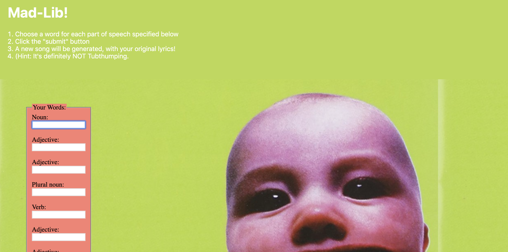
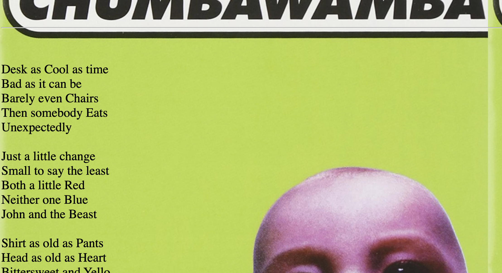

MadLib Challenge
===

Create a web page that allows the user to play a MadLib game!







## Group Work

You should work in a mob on this project, with one person driving and everybody looking at the same screen.

1) One person should make a repo, 
    - Create a new repo called `madlib-game` using the [alchemy bootstrap template](https://github.com/dpcairns/alchemy-bootstrap). 
    - Give everybody else on the permission to work on it. (Settings>Manange Access)
1) Everybody should clone the repo from step #1.
1) (Choose a timer)[https://www.google.com/search?q=pomodoro+timer+browser] and set it to 15 minutes. **Respect the clock and switch team members faithfully!**
1) One person should drive, while everybody else watches and contributes verbally. When the timer expires, that person will push their code, and everybody else will pull, and you will pick a new driver.
    - When it's time for you to "drive", you can `git pull origin main` in your cloned version of the repo to get the freshest code. 
    - When it's time for you to pass off to the next person, add, commit, and `git push origin main` so they can pull to get the freshest code.
    - No harm in gratuitously running `git pull origin main`. The more often you do this, the easier everything will be!
1) If you run merge issues (not expected, but possible), please let us know.

## Make Project Tickets

1. Create a GitHub Project for your repo, you can call it "MadLib Tasks". Choose *basic kanban* as the template.
1. Delete the example cards
1. Create Cards for each of the steps below. Use title and description that clearly articulates the exit criteria
1. Drag the first card into "In Progress" and keep things going!

## Design and Implement MadLib Page

### Overall Concept

Delete:
- everything in the body tag of the primary `index.html` file at the root
- everything in `styles/style.css` file

Come up with your theme and overall page design. Figure out:
- Arrangement of input controls and the story on the page. You can put placeholders like lorem ipsum and an input and button.
- colors, fonts, images, "look and feel"

Give yourself a 15 minute time box for this ticket!

Time for a commit!

### MadLib Story

Come up with a few short paragraphs and pick some key words for which the user will provide values. Time box this to 5-10 minutes.

Use `<span>`'s for "blanks" where the words will be inserted and give each one an `id`. Keep in mind each span needs a unique `id`, so you might sequentially number them like `noun-1`, `noun-2`. 

Read your html code and improve.

Time for a commit!

### Prompt for Words

Provide labels and inputs for the user. Describe the grammar you want them to provide (noun, verb, adjective, etc). Keep in mind each input needs a unique `id`, so you might sequentially number them like `noun-1-input`, `noun-2-input`.

Also provide a button for them to click when it is time to make the MadLib. 

Read your html code and make any needed improvements.

Time for a commit!

## Make Tested `sync` function

1. In your example test file, delete the example test and paste in this one:
    ```js
    test('sync input to element', (expect) => {
        //Arrange
        const input = document.createElement('input');
        const span = document.createElement('span');
        const expected = 'banana';
        input.value = expected;
        
        //Act 
        sync(input, span);

        //Expect
        expect.equal(span.textContent, expected);
    });
    ```
1. Create a `dom-utilities.js` file at the root of the project and export a function called `sync`
1. Import this function into your test and verify that you have a failing test that looks like:
    ```
    Expected:   "banana"
    Result:     ""
    Diff: 	    "banana"
    ```
1. Add code to your `sync` function to make the test pass!

Time for a commit!

## Make MadLib

1. In your JavaScript `app.js`, make variables for all the DOM elements you will
to read data from (input form controls) or write data to (text spans).
1. Add a function, then add an event listener attribute to the button that calls the function. Validate that the function is running when the button is clicked.
1. Import your `sync` function into `app.js`
1. Write JavaScript logic in your function that mediates data between the inputs and the spans. Using your sync function to copy the value.
1. Validate that it works

Read your code and make any needed improvements, make it as well crafted as you possibly can!

Time for a commit!

## Reveal MadLib

Your MadLib is working, but part of the fun is not knowing what the story is. Find the containing element for your story and:
1. Create a CSS class (like `.hidden`) to hide the story (see [docs on controling `display`](https://developer.mozilla.org/en-US/docs/Web/CSS/display))
1. Add that class and an `id` attribute to the containing element.
1. Reference the element in your JavaScript
1. In your function, add a line to remove the hidden class from the element. See if you can figure out how to do that based on [the docs](https://developer.mozilla.org/en-US/docs/Web/API/Element/classList). Feel free to discuss and share with classmates!
1. Validate that it works

Read your JavaScript code and make any needed improvements.

Time for a commit!

## Show the World

1. Push to GitHub
1. Turn on GitHub pages so everyone can play your MadLib game!

## Points Break Down

Looking For | Points (10)
:--|--:
Deployed on GitHub pages, with link in the About section of the Github repo | 2
Nice styling and semantic HTML | 2
Inputs (with ids) and Spans (with corresponding ids) for each word that will be replaced in Mad Lib | 2
On clicking the submit button, show the Mad Lib text (initially hidden) | 2
On clicking the submit button, replace `<span/>`s with the correct words from text inputs | 2
